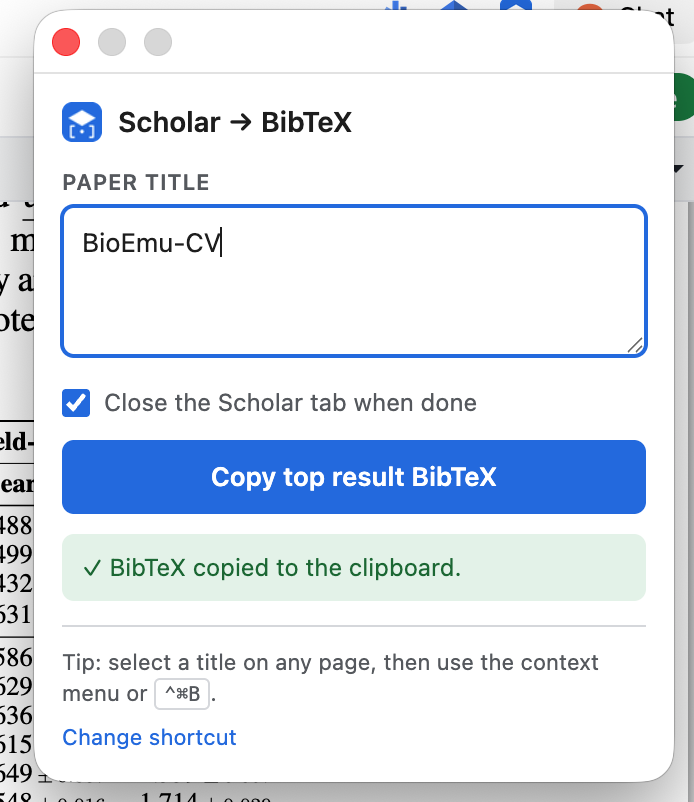

<p align="center">
  
</p>

<h1 align="center">Scholar2BibTeX</h1>

<p align="center">
  드래그 → 단축키 → Google Scholar 최상단 결과의 BibTeX가 클립보드에.<br>
  <em>Drag → shortcut → the top Google Scholar result's BibTeX is on your clipboard.</em>
</p>

<p align="center">
  
</p>

<p align="center"><sub>v1.5.0 · Manifest V3 · Chrome 116+</sub></p>

---

## 사용법 / Usage

### 한국어

1. Overleaf(또는 아무 웹페이지)에서 **검색할 논문 제목을 드래그**합니다.
2. 단축키를 누릅니다 — macOS `⌃⌘B` (Control+Command+B), Windows·Linux `Ctrl+Shift+B`.
3. Google Scholar **최상단 결과의 BibTeX가 알아서 클립보드에 복사**됩니다. `.bib` 파일에 그대로 붙여넣으면 끝입니다.

진행 상황은 확장 아이콘 배지로 확인할 수 있습니다 — `...` 진행 중, `✓` 성공, `!` 실패.

### English

1. In Overleaf (or any web page), **drag-select the paper title** you want to look up.
2. Press the shortcut — `⌃⌘B` (Control+Command+B) on macOS, `Ctrl+Shift+B` on Windows/Linux.
3. The BibTeX of the **top Google Scholar result is copied to your clipboard** automatically. Paste it straight into your `.bib` file.

The toolbar badge shows progress — `...` working, `✓` copied, `!` failed.

<details>
<summary><b>다른 방법 / Other ways</b></summary>

- **팝업 / Popup** — 확장 아이콘을 누르고 제목을 입력한 뒤 Enter. / Click the icon, type a title, hit Enter.
- **우클릭 / Right-click** — 선택한 제목에서 우클릭 → *Copy Scholar BibTeX for "…"*. / Right-click the selection → *Copy Scholar BibTeX for "…"*.

</details>

---

## 단축키 동작 / What the shortcut does

단축키는 **딱 두 가지 중 하나**만 합니다. / The shortcut does exactly one of two things:

| 상황 / Situation | 동작 / Behaviour |
| --- | --- |
| 현재 탭에 **드래그된 텍스트가 있음** / there is a selection | 그 텍스트로 바로 검색합니다. / Searches it immediately. |
| **선택 영역이 없음** / no selection | 확장 창(팝업)이 열립니다. 직접 입력하세요. / The popup opens for manual entry. |

**클립보드는 읽지 않습니다.** 사용자가 마지막에 복사한 것 — 대개 논문 제목과 무관한 것 — 이 조용히 Scholar 검색으로 둔갑하는 걸 막기 위해서입니다. 선택 영역이 없으면 그냥 물어봅니다.<br>
<em>The clipboard is never read. If there's no selection, it asks instead of guessing.</em>

팝업을 열면 마지막 검색어가 `last search` 라벨과 함께 미리 채워져 있습니다. 텍스트가 선택된 상태라 그냥 타이핑하면 덮어써집니다. 자동으로 검색되지는 않습니다.<br>
<em>The popup prefills your `last search`, pre-selected so typing replaces it. It never auto-searches.</em>

**선택한 텍스트가 제목인지도 보수적으로 판단합니다.** 잘못 판단하면 엉뚱한 Scholar 탭이 열리고 요청을 낭비하니까요. 다음은 전부 무시하고 팝업으로 넘어갑니다. / *The selection still has to look like a title — a false positive would burn a Scholar request. These are all rejected:*

- **`@`로 시작하는 BibTeX** — 실수로 자기 출력을 다시 검색하는 걸 막습니다. / *Our own output, selected by accident.*
- URL, 파일 경로, 도메인 (`https://…`, `~/Downloads/refs.bib`, `arxiv.org/abs/…`)
- JSON·HTML처럼 `{`, `[`, `<`로 시작하는 것 / structured payloads
- 3자 미만, 300자 초과, 문단(7줄 이상), 글자가 하나도 없는 것 / too short, too long, a whole paragraph, no letters

단어 하나짜리 선택도 통과합니다 — `BERT`, `ViT`, `word2vec`처럼 모델·데이터셋 이름을 드래그하는 경우가 많아서입니다. 다만 2자 이하(`T5`, `C4`)는 여전히 걸러집니다.<br>
<em>A single word is accepted — model and dataset names are what people actually drag. Two characters or fewer (`T5`, `C4`) are still rejected.</em>

---

## Scholar 탭 처리 / Close the Scholar tab when done

팝업의 **Close the Scholar tab when done** 체크박스로 성공 후 Scholar 탭을 어떻게 할지 정합니다. / The popup checkbox decides what happens to the Scholar tab on success.

- **켜짐(기본값) / on (default)** — BibTeX를 복사하면 Scholar 탭을 자동으로 닫습니다.
- **꺼짐 / off** — 탭을 백그라운드에 그대로 둡니다. 검색 결과가 맞는지 눈으로 확인하거나 PDF·인용 횟수를 이어서 볼 때 유용합니다. 팝업에 "The Scholar tab was left open."이라고 표시됩니다.

설정은 브라우저를 재시작해도 유지되며, 팝업·우클릭 메뉴·단축키 모두에 똑같이 적용됩니다. 작업 도중에 바꾸면 그 작업이 끝날 때 바로 반영됩니다.<br>
**실패한 작업의 탭은 이 설정과 무관하게 항상 남습니다** — 원인을 볼 수 있어야 하니까요. CAPTCHA인 경우에는 해당 탭으로 전환까지 합니다.<br>
<em>The setting survives a browser restart and applies to every entry point. Failed jobs always keep their tab open regardless, so you can see what went wrong.</em>

---

## 설치 / Installation

Chromium 기반 브라우저(Chrome, Edge, Brave, Arc, Dia, Whale 등)에서 동작합니다.<br>
Works on any Chromium-based browser (Chrome, Edge, Brave, Arc, Dia, Whale, …). Chrome 116+ 필요 / Chrome 116+ required.

### 한국어

1. 이 저장소를 클론하거나 ZIP으로 내려받아 압축을 풉니다.
2. 주소창에 `chrome://extensions` 를 입력해 확장 프로그램 관리 페이지를 엽니다.
3. 오른쪽 위 **개발자 모드(Developer mode)** 를 켭니다.
4. **압축해제된 확장 프로그램을 로드합니다(Load unpacked)** 를 누릅니다.
5. `manifest.json` 이 들어 있는 이 폴더를 선택합니다.
6. 툴바에 확장 프로그램을 고정하면 편리합니다.

### English

1. Clone this repository, or download the ZIP and unzip it.
2. Open `chrome://extensions` in the address bar.
3. Turn on **Developer mode** (top right).
4. Click **Load unpacked**.
5. Select this folder — the one containing `manifest.json`.
6. Pin the extension to your toolbar.

---

## 문제 해결 / Troubleshooting

| 증상 / Symptom | 해결 / Fix |
| --- | --- |
| 단축키가 안 먹힘 / Shortcut does nothing | 다른 앱이 같은 조합을 먼저 잡고 있을 수 있습니다. `chrome://extensions/shortcuts` 에서 변경하세요 (팝업의 *Change shortcut* 링크). / Another app may have claimed it — rebind at `chrome://extensions/shortcuts`. |
| Windows·Linux에서 북마크바가 토글됨 / Bookmarks bar toggles on Windows·Linux | 그쪽 기본값 `Ctrl+Shift+B`가 브라우저 기능과 겹칩니다. 위 링크에서 바꾸세요. / The non-mac default clashes with the browser — rebind it. |
| CAPTCHA 화면 / CAPTCHA screen | 열린 Scholar 탭에서 직접 인증한 뒤 다시 시도하세요. / Solve it in the Scholar tab that opens, then retry. |
| 다른 논문이 복사됨 / Wrong paper copied | 최상단 결과를 그대로 씁니다. 저자나 연도를 함께 드래그하면 정확해집니다. / It always takes the top hit — include the author or year in your selection. |
| 단축키가 팝업만 염 / Shortcut only opens the popup | 선택 영역이 없거나, 선택한 텍스트가 제목으로 인정되지 않은 경우입니다. 팝업에 입력하면 됩니다. / No selection, or it didn't pass the title check — just type it in. |
| 결과를 못 찾음 / "No results" 류 에러 | Scholar의 DOM이 바뀌었을 수 있습니다. `content.js`의 `RESULT_SELECTOR`·`CITE_SELECTOR`·`findBibtexLink`를 확인하세요. / Scholar's DOM may have changed — check those selectors in `content.js`. |

작업 전체 제한 시간은 60초입니다. / Each job times out after 60 seconds.

---

## 권한 / Permissions

| 권한 | 용도 |
| --- | --- |
| `https://scholar.google.com/*` | 검색 결과와 Cite 창에 접근 |
| `https://scholar.googleusercontent.com/*` | Cite 창의 BibTeX 링크가 반환하는 텍스트를 가져오기 |
| `tabs` | 검색용 Scholar 탭을 열고 정리 |
| `activeTab`, `scripting` | 단축키를 누른 **그 순간에만** 현재 탭의 선택 텍스트를 읽기 |
| `storage` | 작업 상태는 세션 저장소, 탭 자동 닫기 설정은 로컬 저장소 |
| `contextMenus` | 선택 텍스트용 우클릭 메뉴 |
| `clipboardWrite`, `offscreen` | 가져온 BibTeX를 클립보드에 **쓰기**. 읽기 권한은 요청하지 않습니다 |

`activeTab`을 쓰므로 설치 시 "모든 사이트의 데이터 읽기" 경고가 뜨지 않습니다.<br>
논문 제목이나 BibTeX를 외부 서버로 전송하지 않습니다. / Nothing is ever sent to a third-party server.

---

## 구조 / Project layout

| 파일 | 역할 |
| --- | --- |
| `background.js` | 서비스 워커. 작업 상태 관리, Scholar 탭 생성, `.bib` fetch, 배지, 컨텍스트 메뉴·단축키 |
| `content.js` | Scholar 페이지에서 최상단 결과 → Cite 클릭 → BibTeX 링크 추출. 숨은 탭에서도 반응하도록 MutationObserver 사용 |
| `title-utils.js` | "선택한 이 텍스트가 논문 제목인가" 판정. 확장이 사용자를 대신해 내리는 유일한 판단이라 따로 분리 |
| `offscreen.js` | 클립보드 **쓰기** 전용 오프스크린 문서 |
| `popup.html/js/css` | 제목 입력, 탭 자동 닫기 체크박스, 실시간 상태 (라이트/다크 대응) |

클립보드는 어느 경로에서도 읽지 않습니다. / *No code path reads the clipboard.*

백그라운드에서 Scholar를 긁지 않고 실제 탭 + 콘텐츠 스크립트로 사용자의 세션을 그대로 씁니다. 동시 1건만 처리하며 대량 수집 기능은 없습니다.<br>
<em>It drives a real tab in your own session rather than scraping in the background — one lookup per user action, no batch mode.</em>

---

## 변경 이력 / Changelog

- **1.5.0** — 단어 하나짜리 선택도 제목으로 인정합니다 (`BERT`, `ViT`). 최소 길이를 6자에서 3자로 낮췄습니다. `build.sh`가 zip과 함께 압축을 푼 폴더도 만듭니다.
- **1.4.1** — macOS 기본 단축키를 `⌃⌘B`(Control+Command+B)로 변경. 기존 `⌘⇧B`는 북마크바 토글과 겹쳤습니다.
- **1.4.0** — **클립보드 읽기 기능 제거.** 단축키는 드래그된 텍스트로 검색하거나, 없으면 팝업을 엽니다. `clipboardRead` 권한도 제거했습니다.
- **1.3.0** — 단축키 입력 우선순위를 드래그 → 클립보드 → 팝업으로 변경 (클립보드 단계는 1.4.0에서 제거). 컨텍스트 메뉴 중복 생성 오류(`Cannot create item with duplicate id`) 수정. 제목 판정 로직을 `title-utils.js`로 분리해 팝업·서비스 워커가 공유.
- **1.1.0** — 팝업에 **Close the Scholar tab when done** 체크박스 추가. 설정은 브라우저를 재시작해도 유지됩니다.
- **1.0.5** — 최초 버전.

---

## 개발 / Development

파일을 수정한 뒤 `chrome://extensions`에서 이 확장 프로그램의 새로고침 버튼을 누릅니다.

- 서비스 워커 로그 — 확장 상세 화면 → *Inspect views: service worker*
- 콘텐츠 스크립트 로그 — Scholar 탭의 DevTools
- 팝업 로그 — 팝업 우클릭 → 검사

### 빌드 / Build

```
./build.sh              # dist/ 에 zip + 압축 푼 폴더
./build.sh -o ~/Desktop # 둘 다 다른 위치로
```

Chrome이 실제로 읽는 파일만 담고, 문서·git·macOS 잔재는 제외합니다. 넣기 전에 `node --check`로 문법과 `manifest.json` JSON 유효성을 검사하므로 깨진 서비스 워커가 그대로 포장되지 않습니다. 압축 푼 폴더는 소스에서 복사하는 게 아니라 만들어진 zip을 다시 풀어서 만듭니다 — **Load unpacked** 로 읽는 것과 배포하는 것이 같다는 뜻입니다.<br>
<em>Only the files Chrome loads go in; the JS is syntax-checked first. The unpacked folder is extracted from the zip, not copied from the tree, so what you load is what you ship.</em>

`FILES` 배열은 `manifest.json`과 직접 맞춰야 합니다. 파일을 추가했는데 배열에 넣지 않으면 저장소는 멀쩡한데 zip만 깨집니다.<br>
<em>Keep the `FILES` array in sync with the manifest — a missing entry is a broken zip, not a broken repo.</em>

설계 배경은 소스 주석에 정리돼 있습니다. 특히 `background.js`의 컨텍스트 메뉴 직렬화(`menuInstall`), 단축키 리스너, `title-utils.js`의 판정 기준은 되돌리기 전에 주석을 먼저 읽어 주세요.
